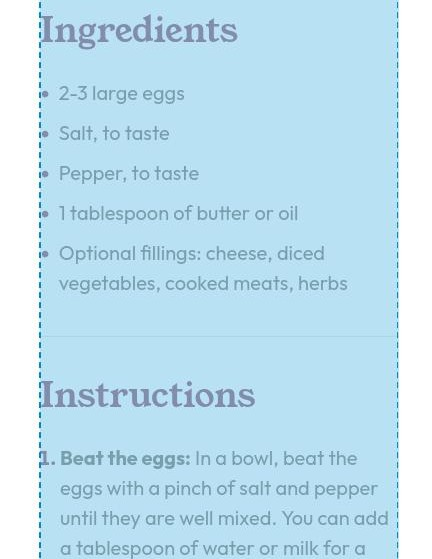
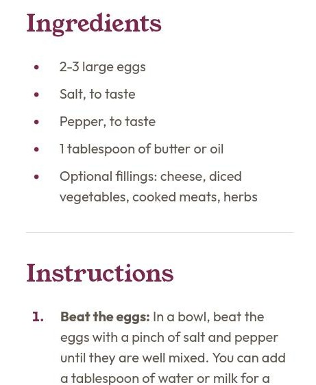

# Notes

## Links

- Challenge URL: [https://www.frontendmentor.io/challenges/recipe-page-KiTsR8QQKm](https://www.frontendmentor.io/challenges/recipe-page-KiTsR8QQKm)
- Live Site URL: [https://finkusuma-dev.github.io/fem-recipe-page](https://finkusuma-dev.github.io/fem-recipe-page)

## HTML Implementation

- Applied mobile design (not yet applied the rem unit).
- Wrapped the solution inside article, as it contains information that can be distributed independently. [^1]
- Put the nutrition list inside `dl` element.

## HTML Issues

### `` alternate text

I added an alternate text to the `img`, but on [MDN Image Guide](https://developer.mozilla.org/en-US/docs/Learn_web_development/Core/Structuring_content/HTML_images#alternative_text), it mentions `alt` can be empty if the body adequately describes the image. Currently, I'm unsure if the image is sufficiently described by this text on the paragraph: "This classic omelette combines beaten eggs cooked to perfection, optionally filled with your choice of cheese, vegetables, or meats."

### Each `h2` and its following content is wrapped inside `section`

I'm not sure if it's a best practice to always wrap `h2` and its following content inside `section`, and also in which cases the section is not needed.

### `<header>` inside `<main>`

Currently, `h1` and `p` elements are directly inside `article`. I asked _Chrome AI Assistant_ on the `article` element if it's better to wrap the `h1` and `p` with the `header`, and the response was that it's a good practice but not mandatory. It could enhance the semantic structure and provide a clear container for introductory content. But having only two elements `h1` and `p`, adding `header` might be considered unnecessary complexity.

The `header` inside `main` is an example in [WebDev Semantic HTML](https://web.dev/learn/html/semantic-html).

### Use `ul` & `ol` or `dl`

The list items within the preparation time and instructions sections, contain a strong element with text and a colon. I'm not sure if it's better use `dl` element with `dt` and `dd` instead.

## CSS Implementation

- `img` element (mobile design): To make the `img` element full width, use negative margin and increase the width to extend through the inline paddings.
- list-item element (margin & padding): Before setting the margin and padding of the list-item according to Figma, first set the margin to align the marker with the text above it.

  ```css
  ul li {
    margin-left: 15px;
  }

  ol li {
    margin-left: 16px;
  }
  ```

  

  And then set the margin and padding accordingly:

  ```css
  ul li {
    margin-left: calc(15px + 8px);
    padding-left: 16px;
  }

  ol li {
    margin-left: calc(16px + 8px);
    padding-left: 16px;
  }
  ```

  

- Nutrition list: table has addition spaces despite tr has correct height.

  Fix:

  ```css
  table,
  tbody {
    border-spacing: 0;
  }
  ```

  `th` and `td` width are not equal.

  Fix:

  ```css
  th,
  td {
    width: 50%;
  }
  ```

- TODO: list-item element (marker position): Make the marker stretch along with the list item height.

## CSS Issues

### Section styling

Preparation section is the first sibling of other sections, which makes the CSS styling of other sections a bit more complex:

```css
/* Start from 3th section */
section:nth-of-type(1n + 3) {
  padding-top: 32px;
}
/* Start from 2nd section, and doesn't include the last section*/
section:nth-of-type(1n + 2):not(:last-of-type) {
  padding-bottom: 32px;
  border-bottom: 1px solid var(--color-Stone-150);
}
```

If the preparation `section` or the `header`, `p`, and preparation `section` are put inside `div`, styling other sections can be more simple with `section:not(:first-of-type)` and `section:not(:last-of-type)`.

## Others

- Screen readers: orca (linux), NVDA, Jaws (windows), talkback (android). Currently, using orca and talkback to test the accessibility of the page.

## Resources

- https://www.w3.org/WAI/ARIA/apg/
- https://www.w3.org/WAI/ARIA/apg/patterns/landmarks/examples/general-principles.html
- https://web.dev/learn/html/semantic-html?continue=https%3A%2F%2Fweb.dev%2Flearn%2Fhtml%2F%23article-https%3A%2F%2Fweb.dev%2Flearn%2Fhtml%2Fsemantic-html
- https://discord.com/channels/824970620529279006/1339214865243312128/1339227042784481290 - Grace Snow's feedback on discord about the same challenge.
- https://stackoverflow.com/questions/8900571/two-column-table-or-dl - Simple guide to choose whether to use two columns table or description list.
- https://www.w3.org/WAI/tutorials/tables/, https://www.w3.org/WAI/EO/Drafts/tutorials/tables/scope/ - W3C tutorial on scope of headers.

---

[^1]: https://developer.mozilla.org/en-US/docs/Web/HTML/Element/article.
