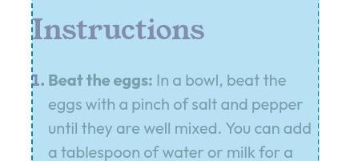
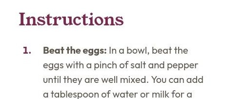

# Frontend Mentor - Recipe page solution

This is a solution to the [Recipe page challenge on Frontend Mentor](https://www.frontendmentor.io/challenges/recipe-page-KiTsR8QQKm). Frontend Mentor challenges help you improve your coding skills by building realistic projects.

## Table of contents

- [Frontend Mentor - Recipe page solution](#frontend-mentor---recipe-page-solution)
  - [Table of contents](#table-of-contents)
  - [Links](#links)
  - [My Process](#my-process)
    - [Built with](#built-with)
    - [HTML Implementations](#html-implementations)
    - [HTML Issues](#html-issues)
      - [🔵 `` alternate text](#-img-alternate-text)
      - [🔵 Each `h2` and its following content is wrapped inside `section`](#-each-h2-and-its-following-content-is-wrapped-inside-section)
      - [🔵 `<header>` inside `<main>`](#-header-inside-main)
    - [CSS Implementations](#css-implementations)
    - [CSS Issues](#css-issues)
      - [🔵 Section styling](#-section-styling)
    - [Notes](#notes)
    - [Continued development](#continued-development)
    - [Useful Resources](#useful-resources)

## Links

- Challenge URL: [https://www.frontendmentor.io/challenges/recipe-page-KiTsR8QQKm](https://www.frontendmentor.io/challenges/recipe-page-KiTsR8QQKm)
- Live Site URL: [https://finkusuma-dev.github.io/fem-recipe-page](https://finkusuma-dev.github.io/fem-recipe-page)

## My Process

### Built with

- Semantic HTML5 markup
- CSS custom properties
- Flexbox
- Mobile-first workflow

### HTML Implementations

- Wrapped the solution inside article, as it contains information that can be distributed independently. [^1]
- Put the nutrition list inside a `table` element.

### HTML Issues

#### 🔵 `` alternate text

I added an alternate text to the `img`, but on [MDN Image Guide](https://developer.mozilla.org/en-US/docs/Learn_web_development/Core/Structuring_content/HTML_images#alternative_text), it mentions `alt` can be empty if the body adequately describes the image. Currently, I'm unsure if the image is sufficiently described by this text on the paragraph: "This classic omelette combines beaten eggs cooked to perfection, optionally filled with your choice of cheese, vegetables, or meats."

#### 🔵 Each `h2` and its following content is wrapped inside `section`

I'm not sure if it's correct to wrap the each of `h2` and its following content inside `section`.

#### 🔵 `<header>` inside `<main>`

Currently, `h1` and `p` elements are directly inside `article`. I asked _Chrome AI Assistant_ on the `article` element if it's better to wrap the `h1` and `p` with the `header`, and the response was that it's a good practice but not mandatory. It could enhance the semantic structure and provide a clear container for introductory content. But having only two elements `h1` and `p`, adding `header` might be considered unnecessary complexity.

The `header` inside `main` is an example in [WebDev Semantic HTML](https://web.dev/learn/html/semantic-html).

### CSS Implementations

- Utilize CSS variables to store `px` and `rem` units as both are used depending on the need.

  ```css
  /* variable with rem unit, to use the size without design token*/
  --4px: 0.25rem;

  /* spacing variable with `px` unit */
  --spacing-50px: 4px;

  /* spacing variable with `rem` unit */
  --spacing-50rem: calc(4rem / 16);
  ```

- Using `rem` for vertical spacings, and using `px` for horizontal spacings and other sizes that don't need to scale with the default font size.

  Horizontal spacings that are related with text also use `rem`. For example: space between marker and list-item text.

  Below are detail of props using `px` and `rem`:

  `px`:

  - Horizontal margin & padding.
  - Image height: `px` is used to set the image height on the tablet design. If using `max-height`, the image height shrinks as it tries to calculate the height based on the image ratio. On mobile design image height is set to `auto`.
  - Border radius.
  - Border thickness.

  `rem`:

  - Vertical margin & padding.
  - Container's width.
  - Image width (Set to 100% from its parent `rem` width).
  - font sizes.
  - Space between marker and list item text.
  - Inline text padding on `th` and `td`.

- Positioning the image element on the mobile design. To make the image element full width, use negative margin and increase the width to extend through the inline paddings.
- Creating marker spacing on the Instructions list. Before setting the margin and padding of the list-item according to Figma, first reset the margin & padding using:

  ```css
  * {
    margin: 0;
    padding: 0;
  }
  ```

  Then set the margin to align the marker with the text above it.

  ```css
  ol li {
    margin-left: 16px;
  }
  ```

  

  And then set the margin and padding accordingly:

  ```css
  ol li {
    margin-left: calc(16px + 8px);
    padding-left: 16px;
  }
  ```

  

- Make the list-item marker stretch along the `li` height.

  After trial and error, this is what I came up with. I removed the list-style using `list-style: none`. Then created a new bullet (a circle shape) using `li::before` pseudo-element. I positioned it vertically center using `position:absolute; top:50%; transform: translateY(-50%);`. It worked, but there was a problem, screenreaders didn't announce the bullet character.

  Then I removed the circle shape and used `content: '\2020'` to add the bullet character. The screenreader did announce it, but it was really difficult to precisely center the character vertically.

  My final solution is adding the circle shape again, but then hide the bullet character by setting the `color` to `transparent`.

  ```css
  ul {
    list-style: none;
  }

  li {
    padding-left: 40px;
    position: relative;
  }

  li::before {
    /* Visual circle */
    width: 4px;
    height: 4px;
    border-radius: 4px;
    background-color: var(--color-Rose-800);

    /* Visual circle positioning, stretch along the `li` height */
    top: 50%;
    left: 8px;
    transform: translateY(-50%);
    position: absolute;

    /* Visually hidden circle character so screenreader will announce the bullet character */
    content: '\2022';
    color: transparent;
  }
  ```

- Nutrition list: The table had addition spaces somewhere that made overall height was more than the total height of the rows. This caused by default `border-collapse` property is `separate`, which separate the border between cells. To fix this I set `border-collapse` to `collapse`.

  ```css
  table {
    border-collapse: collapse;
  }
  ```

  There was also issue where `th` (1st column) and `td` (2nd column) width are not equal. When the table occupies the parent's width, the column's width distribution is affected by the basis width each of the column. And each of the column's width depends on the most wide cell in that column, which is impacted by the cell content.

  To make both columns equal, I set the width to `50%`.

  ```css
  th,
  td {
    width: 50%;
  }
  ```

### CSS Issues

#### 🔵 Section styling

Preparation section is the first sibling of other sections, which makes the CSS styling of other sections a bit more complex:

```css
/* Start from 3th section */
section:nth-of-type(1n + 3) {
  padding-top: 32px;
}
/* Start from 2nd section, and doesn't include the last section*/
section:nth-of-type(1n + 2):not(:last-of-type) {
  padding-bottom: 32px;
  border-bottom: 1px solid var(--color-Stone-150);
}
```

If the preparation `section` or the `header`, `p`, and preparation `section` are put inside `div`, styling other sections can be more simple with `section:not(:first-of-type)` and `section:not(:last-of-type)`.

### Notes

- Screen readers: orca (linux), NVDA, Jaws (windows), talkback (android). Currently, using orca and talkback to test the accessibility of the page.

### Continued development

- I wrap each of `h2` and its following content with `section`. But in [here](https://discord.com/channels/824970620529279006/1339214865243312128/1339227042784481290) Grace Snow's feedback on the same challenge mentions that the sections on the main don't bring semantic benefit, and only the preparation time needs to be put in section. Could someone explain why there are no semantic benefit here using the sections?
- In [WebDev Semantic HTML](https://web.dev/learn/html/semantic-html), there is an example of the `header` inside `main`. In which cases can/should we use this?
- This is the code I made in the unordered list to make the bullet stretch the `li` height. I use custom circle shape for visual, and a hidden bullet to make the screenreaders announce the bullet character.

  ```css
  ul {
    list-style: none;
  }

  li {
    padding-left: 40px;
    position: relative;
  }

  li::before {
    /* Visual circle */
    width: 4px;
    height: 4px;
    border-radius: 4px;
    background-color: var(--color-Rose-800);

    /* Visual circle positioning, stretch along the `li` height */
    top: 50%;
    left: 8px;
    transform: translateY(-50%);
    position: absolute;

    /* Visually hidden circle character so screenreader will announce the bullet character */
    content: '\2022';
    color: transparent;
  }
  ```

  Is there maybe more simple solution for this stretch height bullet?

### Useful Resources

- https://www.w3.org/WAI/ARIA/apg/
- https://www.w3.org/WAI/ARIA/apg/patterns/landmarks/examples/general-principles.html
- https://web.dev/learn/html/semantic-html?continue=https%3A%2F%2Fweb.dev%2Flearn%2Fhtml%2F%23article-https%3A%2F%2Fweb.dev%2Flearn%2Fhtml%2Fsemantic-html
- https://discord.com/channels/824970620529279006/1339214865243312128/1339227042784481290 - Grace Snow's discord feedback on the same challenge.
- https://stackoverflow.com/questions/8900571/two-column-table-or-dl - Simple guide to choose whether to use two columns table or description list.
- https://www.w3.org/WAI/tutorials/tables/, https://www.w3.org/WAI/EO/Drafts/tutorials/tables/scope/ - W3C tutorial on scope of headers.
- https://css-tricks.com/everything-you-need-to-know-about-the-gap-after-the-list-marker/ - Unicode characters that can be used as custom list markers.

---

[^1]: https://developer.mozilla.org/en-US/docs/Web/HTML/Element/article.
