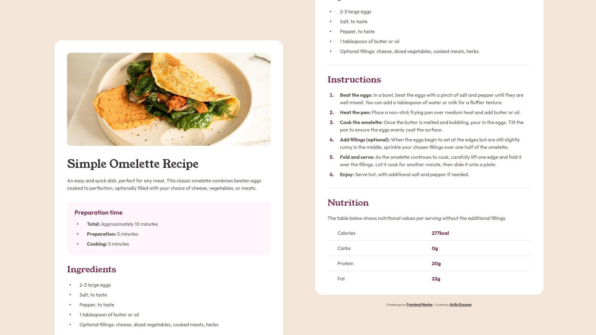

# Frontend Mentor - Recipe page solution

This is a solution to the [Recipe page challenge on Frontend Mentor](https://www.frontendmentor.io/challenges/recipe-page-KiTsR8QQKm). Frontend Mentor challenges help you improve your coding skills by building realistic projects.

## Table of contents

- [Frontend Mentor - Recipe page solution](#frontend-mentor---recipe-page-solution)
  - [Table of contents](#table-of-contents)
  - [Overview](#overview)
    - [The challenge](#the-challenge)
    - [Screenshot](#screenshot)
    - [Links](#links)
  - [My Process](#my-process)
    - [Built with](#built-with)
    - [HTML Implementations](#html-implementations)
    - [HTML Issues](#html-issues)
      - [🟠 `` alternate text](#-img-alternate-text)
      - [🟠 `<header>` inside `<main>`](#-header-inside-main)
    - [CSS Implementations](#css-implementations)
      - [🔵 CSS variables for `px` and `rem`](#-css-variables-for-px-and-rem)
      - [🔵 Implementation of `px` and `rem`](#-implementation-of-px-and-rem)
      - [🔵 Image element on the mobile design](#-image-element-on-the-mobile-design)
      - [🔵 Create marker spacing in the instructions list](#-create-marker-spacing-in-the-instructions-list)
      - [🔵 Stretch height of the list-item marker](#-stretch-height-of-the-list-item-marker)
      - [🔵 Set the block paddings of `recipe-info` div](#-set-the-block-paddings-of-recipe-info-div)
      - [🔵 Styling Nutrition list](#-styling-nutrition-list)
    - [Notes](#notes)
    - [Continued development](#continued-development)
    - [Useful Resources](#useful-resources)
  - [Author](#author)

## Overview

### The challenge

Your challenge is to build out this recipe page and get it looking as close to the design as possible.

### Screenshot



### Links

- Solution URL: [https://www.frontendmentor.io/solutions/responsive-recipe-page-utilizing-both-px-and-rem-units-j1Pfeyljuj](https://www.frontendmentor.io/solutions/responsive-recipe-page-utilizing-both-px-and-rem-units-j1Pfeyljuj)
- Live Site URL: [https://finkusuma-dev.github.io/fem-recipe-page](https://finkusuma-dev.github.io/fem-recipe-page)

## My Process

### Built with

- Semantic HTML5 markup
- CSS custom properties
- Flexbox
- Mobile-first workflow

### HTML Implementations

- Wrapped the solution inside article, as it contains information that can be distributed independently. [^1]
- Put the nutrition list inside a `table` element.
- Wrap each of the `h2` and its following content with `div`, as it doesn't have a semantic benefit when using `section`. There are already `h2` elements which can be used as an accessibility navigation.
- Using table for nutrition list with the first column as row headers.
  ```html
  <table>
    <tr>
      <th scope="row">Calories</th>
      <td>277kcal</td>
    </tr>
    <tr>
      <th scope="row">Carbs</th>
      <td>0g</dtd< /tr>
    <tr>
    ...
  </table>
  ```

### HTML Issues

#### 🟠 `` alternate text

I added an alternate text to the `img`, but on [MDN Image Guide](https://developer.mozilla.org/en-US/docs/Learn_web_development/Core/Structuring_content/HTML_images#alternative_text), it mentions `alt` can be empty if the body adequately describes the image. Currently, I'm unsure if the image is sufficiently described by this text on the paragraph: "This classic omelette combines beaten eggs cooked to perfection, optionally filled with your choice of cheese, vegetables, or meats."

#### 🟠 `<header>` inside `<main>`

There is an example of a `header` inside `main` in [WebDev Semantic HTML](https://web.dev/learn/html/semantic-html). The header becomes "headerAsNonLandmark" and it is not used or given any special status by screenreaders.

### CSS Implementations

#### 🔵 CSS variables for `px` and `rem`

Utilize CSS variables to store `px` and `rem` units as both are used depending on the need.

```css
/* variable with rem unit, to use the size without design token*/
--4px: 0.25rem;

/* spacing variable with `px` unit */
--spacing-50px: 4px;

/* spacing variable with `rem` unit */
--spacing-50rem: calc(4rem / 16);
```

#### 🔵 Implementation of `px` and `rem`

Use `rem` for vertical spacings, and use `px` for horizontal spacings and other sizes that don't need to scale with the default font size.

Horizontal spacings that are related with text also use `rem`. For example: space between marker and list-item text.

Below are list of props using `px` and `rem`:

`px`:

- Horizontal margin & padding.
- Image height: `px` is used to set the image height on the tablet design. If using `max-height`, the image height shrinks as it tries to calculate the height based on the image ratio. On mobile design image height is set to `auto`.
- Border radius.
- Border thickness.

`rem`:

- Vertical margin & padding.
- Container's width.
- Image width (Set to 100% from its parent `rem` width).
- font size.
- Space between marker and list item text.
- Inline padding on `th` and `td`.

#### 🔵 Image element on the mobile design

To make the image element full width, use negative margin and increase the width to extend through the inline paddings.

#### 🔵 Create marker spacing in the instructions list

Before setting the margin and padding of the list-item according to Figma, first reset the margin & padding using:

```css
* {
  margin: 0;
  padding: 0;
}
```

Then set the margin to align the marker with the text above it.

```css
ol li {
  margin-left: 16px;
}
```

  

And then set the margin and padding accordingly:

```css
ol li {
  margin-left: calc(16px + 8px);
  padding-left: 16px;
}
```

  

#### 🔵 Stretch height of the list-item marker

After trial and error to make the list-item marker stretch along the `li` height, this is what I came up with. I removed the list-style using `list-style: none`. Then created a new bullet (a circle shape) using `li::before` pseudo-element. I positioned it vertically center using `position:absolute; top:50%; transform: translateY(-50%);`.

```css
ul {
  list-style: none;

  li {
    padding-left: 40px;
    position: relative;
  }

  li::before {
    content: '';
    /* Visual circle */
    width: 4px;
    height: 4px;
    border-radius: 4px;
    background-color: var(--color-Rose-800);

    /* Visual circle positioning, stretch along the `li` height */
    top: 50%;
    left: 8px;
    transform: translateY(-50%);
    position: absolute;
  }
}
```

The circle shape positioning implementation with flex:

```css
ul {
  list-style: none;

  li {
    display: flex;
    align-items: center;
  }

  /* Custom bullet */
  li::before {
    content: '';
    display: inline-block;
    flex-shrink: 0;

    /* Circle bullet*/
    width: var(--4px);
    height: var(--4px);
    margin-left: var(--8px);
    margin-right: calc(var(--32px) - var(--4px));
    border-radius: var(--4px);
    background-color: var(--color-Rose-800);
  }
}
```

I used visually hidden bullet character `\2022` to make screenreaders announce the bullet, but Grace Snow suggests that it's better to not use it but add `role=list` on the `ul` instead.

#### 🔵 Set the block paddings of `recipe-info` div

```css
/* Start from 3th div */
.recipe-info:nth-of-type(1n + 3) {
  padding-top: 32px;
}
/* Start from 2nd div, and doesn't include the last div*/
.recipe-info:nth-of-type(1n + 2):not(:last-of-type) {
  padding-bottom: 32px;
  border-bottom: 1px solid var(--color-Stone-150);
}
```

#### 🔵 Styling Nutrition list

The table had addition spaces somewhere that made overall height was more than the total height of the rows. This caused by default `border-collapse` property is `separate`, which separate the border between cells. To fix this I set `border-collapse` to `collapse`.

```css
table {
  border-collapse: collapse;
}
```

There was also issue where `th` (1st column) and `td` (2nd column) width are not equal. When the table occupies the parent's width, the column's width distribution is affected by the basis width each of the column. And each of the column's width depends on the most wide cell in that column, which is impacted by the cell content.

To make both columns equal, I set the width to `50%`.

```css
th,
td {
  width: 50%;
}
```

### Notes

- Screen readers: orca (linux), NVDA, Jaws (windows), talkback (android). Currently, using NVDA, Orca and Talkback to test the accessibility of the page.

### Continued development

I'll make sure to remember these feedback from Grace Snow for the next challenges:

- For not using the `section` if there is already heading in the block. The headings are used not only to structure the page but also for the accessibility navigation.
- `header` inside `main` doesn't have any meaning and not given any special status by screenreaders.
- To not use content in `::before` pseudo-element of the custom bullet and giving the `role=list` in the `ul` element.

### Useful Resources

- https://www.w3.org/WAI/ARIA/apg/patterns/landmarks/examples/general-principles.html - Example of landmarks.
- https://web.dev/learn/html/semantic-html - WebDev Semantic HTML guide.
- https://discord.com/channels/824970620529279006/1339214865243312128/1339227042784481290 - Grace Snow's discord feedback on the same challenge.
- https://stackoverflow.com/questions/8900571/two-column-table-or-dl - Simple guide to choose whether to use two columns table or description list.
- https://www.w3.org/WAI/tutorials/tables/, https://www.w3.org/WAI/EO/Drafts/tutorials/tables/scope/ - W3C tutorial on scope of headers.
- https://developer.mozilla.org/en-US/docs/Web/HTML/Element/th - MDN `th` documentation.
- https://css-tricks.com/everything-you-need-to-know-about-the-gap-after-the-list-marker/ - Unicode characters that can be used as custom list markers.

## Author

- Github - [@finkusuma-dev](https://github.com/finkusuma-dev)
- Frontend Mentor - [@finkusuma-dev](https://www.frontendmentor.io/profile/finkusuma-dev)
- Twitter - [@finkusuma_dev](https://www.twitter.com/finkusuma_dev)

---

[^1]: https://developer.mozilla.org/en-US/docs/Web/HTML/Element/article.
